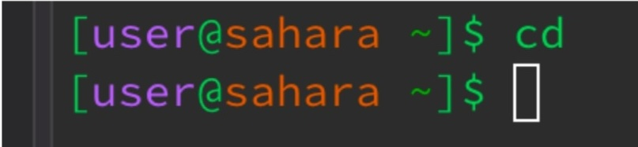
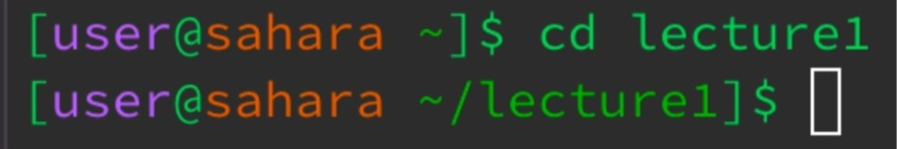
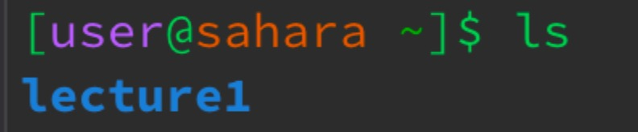
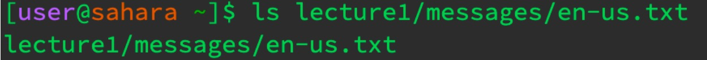
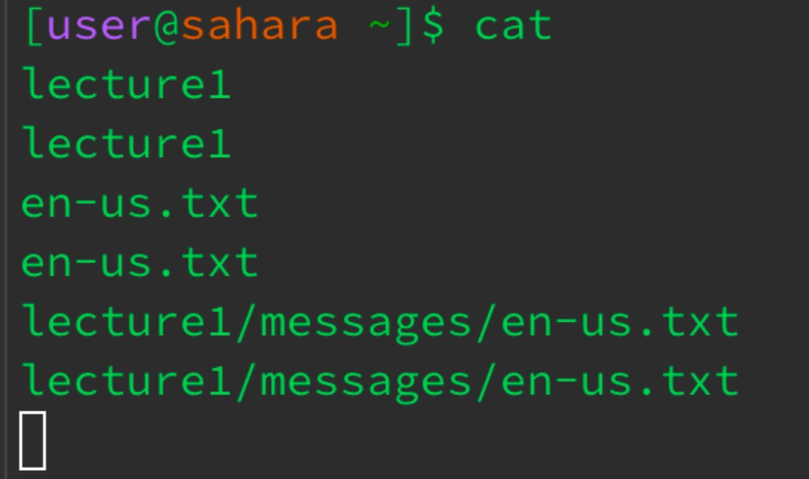
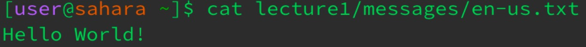

**Lab Report 1**

**Command: cd**

Example with no argument:
                       
The working directory was lecture 1 when this command was run. Since this was one of the first commands to be run in the terminal, the change directory command just defaulted to the home directory which contains the lecture1 folder as part of its list. When it has no argument, it by default resets to the first directory in the path this being home. This output is not an error and is rather a means to reset the directory in the terminal.

Example with a directory:

The working directory is the home directory therefore running the command “cd lecture1” since it paths to it. Given this, the command will change the directory to lecture 1 and will be able to see the files and folder within as it is a path from home to lecture1. This does not give an output similar to cd without an argument but it does change the directory from home to lecture1 and so it will now have a path to folders and files within. There is no error with this output and simply changes the working directory.

Example with a file:

The working directory was home by running cd with no argument. When you run a command with a path to a file, it provides an error message because the cd command expects a directory as the argument so when you provide a file, it cannot change it to something that is not a directory. This is an error and comes from the language text files in messages. 

**Command ls**

Example with no argument:
                        
The terminal was clear so the working directory was home. When typing the command ls with no argument and just the command itself in the terminal, the output is going to be lecture1 because the command itself lists files and folders within the directory so in the home directory there is the file “lecture1” which is returned as a result. There is no output error as a result because the “ls” command gives the list for the working directory.

Example with a directory:

The working directory was the home directory. When typing the command “ls lecture1” into the terminal, given that lecture1 is a folder that is a path from home directory, then the command “ls” is able to see into the lecture1 directory and therefore give the list of folder and files within lecture1. So it returns “Hello.class Hello.java messages README” as a list of folders and files that belong in the “lecture1” folder. There is no error since the output works and is correct.

Example with a file:

The working directory was the home directory. Typing the command “ls lecture1/messages/en-us.txt” as the argument (with the argument being a path to the file), returns the argument. Since the ls command is intended to return a list, given that it seems intended for a directory, then a file and its contents won’t be read since it’s the file itself and it does not contain a list of files or folders so by default the command returns the argument given with “ls.” There is no evident error but it can be said that it is not a correct/effective use of the command since files don’t contain folders or subsets of other files, therefore the terminal returns an output of the argument and doesn’t actually do its intended purpose/use.

**Command cat**

Example with no argument:

The working directory was the home directory. Given this, and given the cat command that returns the contents of a file, when you put no argument and just type cat in as the command in the terminal, it just starts taking in whatever the user input is (when clicking enter) and returns it letter for letter. Presuming that the command just defaults to user input and returns text from the user input. This can be argued to be an error given that it doesn’t take commands anymore in the terminal and you kind of are stuck there, with the terminal just returning whatever is inputted.

Example with a directory:

The working directory was set to the home directory. Giving the command cat a directory as an argument results in “cat lecture1” having an output of an error in which it tells us that the argument is a directory. This is the output of cat with a directory argument because the command cat expects to print out the contents of one or more files given by the path and therefore results in an error as an output as “lecture1” is a directory (and a folder) which is not a file and therefore is unable to print or run as a command. This is definitely an error since clearly a directory isn’t the same as a file and the command runs into an error in trying to print the contents of a directory and therefore gives that output as a result of a directory as an argument.

Example with a file:

The working directory was the home directory. Since it is the home directory, we give a path to a file as an argument for the cat command so when “cat lecture1/messages/en-us.txt” is run in the terminal, it gives an output of the contents of the file. This is what the command cat does as it prints out the contents of one or more files and so giving “en-us.txt” file as the argument has its contents printed out which is “Hello World!” There is no error at all since the command is run with the correct type of argument for it to work which in this case is a file. 
