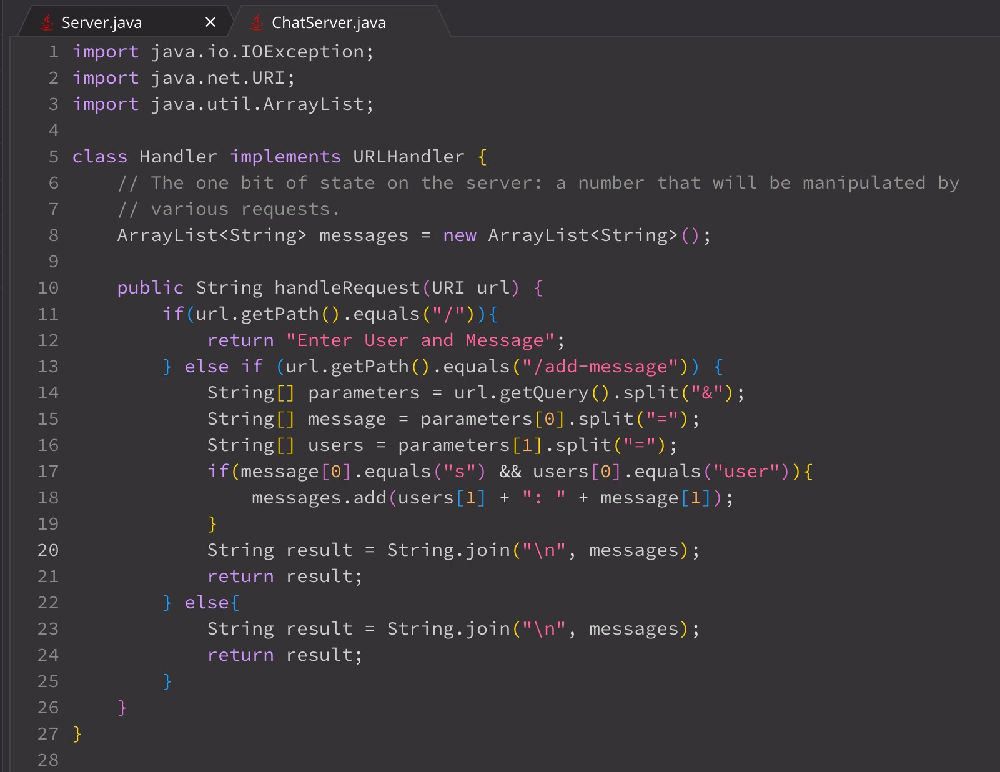
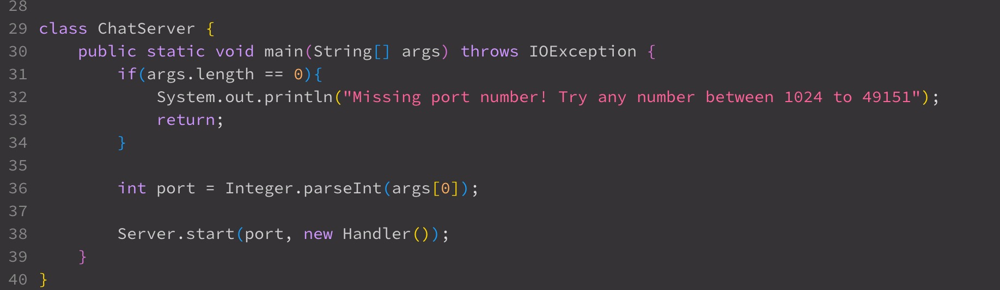
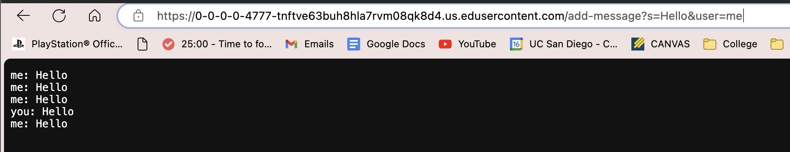
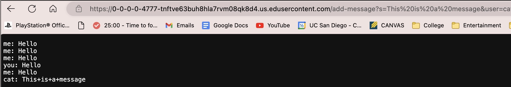
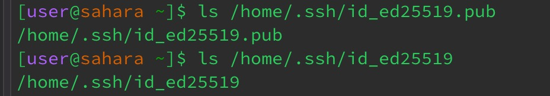
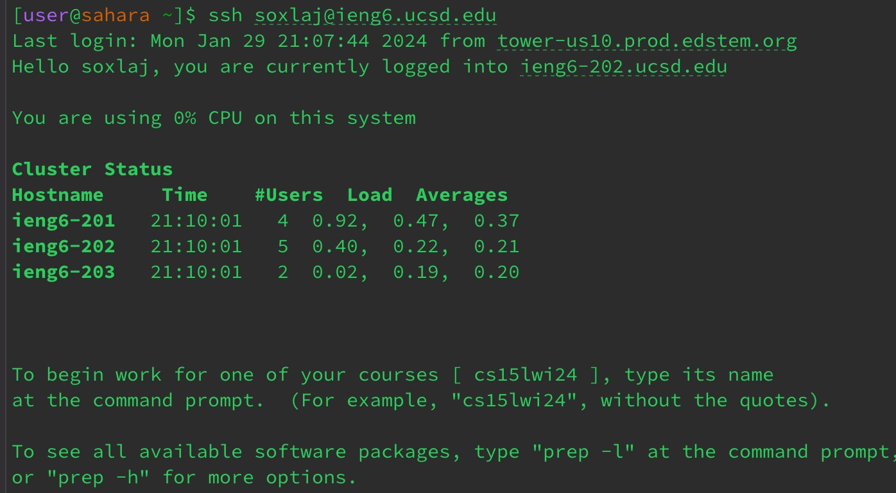

Part 1 - 
Image of Code



Input 1

methods called:

relavent arguments & relavent fields:

relavent fields changed with request:

Input 2

methods called:

relavent arguments & relavent fields:

relavent fields changed with request:

Part 2 - 
```ls command```


logging in ```ieng6``` without password


Part 3 - 
Something that I didn't know before lab 2 and 3 was connecting to servers and that we can use URL and URI's to encode and create a webserver that can change based on the Path and Query input of the webserver's URL. 
This ties with the notion of ports as well where I wasn't aware computers needed ports or how that connected with the notion of webservers. This came with new knowledge about commands like ```ssh``` ```scp``` ```mkdir```
and more. These are very useful with setting up remote servers and setting up ```ssh keys```.
