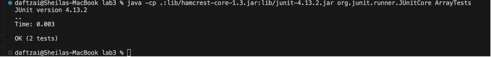

## Lab Report 3

### Part 1 -

**Provide:**

A failure-inducing input for the buggy program, as a JUnit test and any associated code.
```
public class ArrayTests {
  @Test
  public void testReverseInPlace() {
    int[] input1 = {1, 2, 3};
    ArrayExamples.reverseInPlace(input1);
    assertArrayEquals(new int[]{3, 2, 1}, input1);
  }
}
```
An input that doesn't induce a failure, as a JUnit test and any associated code.
```
public class ArrayTests {
  @Test
  public void testReverseInPlace() {
    int[] input1 = {1, 2, 3};
    ArrayExamples.reverseInPlace(input1);
    assertArrayEquals(new int[]{3, 2, 1}, input1);
  }
}
```
The symptom, as the output of running the tests
**Failure:**


**Success:**


The bug, as the before-and-after code change required to fix it (as two code blocks in Markdown)
**Before:**
```
static void reverseInPlace(int[] arr) {
  for(int i = 0; i < arr.length; i+=1){
    arr[i] = arr[arr.length - i - 1];
  }
}
```

**After:**
```
static void reverseInPlace(int[] arr) {
  int[] copyArr = new int[arr.length];
  System.arraycopy(arr, 0, copyArr, 0, arr.length);
  for(int i = 0; i < arr.length; i+=1){
    arr[i] = copyArr[arr.length - i - 1];
  }
}
```

Briefly describe why the fix addresses the issue.
This is the fix for the bug because initially the code only iterated through the array given as a parameter and started setting the beginning values of the array to the ending values and iterating till it reached the end where the ending values ended at the beginning of the array `arr[arr.length - i - 1]` which ensured that it would end at the start of the array and set values of the start to the end of the new reversed array. The issue lies in the fact this array changes the beginning values from the start so the original starting values are replaced and the reverseInPlace method only returns roughly half of the values in the original array and rest are copies and duplicates of these which isn’t a reversed array. To combat this, we make a copy of the given array in a new array called copyArray and then begin setting the beginning of arr to the backwards iteration of the copied array which successfully gives us the values of the original array in reverse order in the original array. Therefore, when given an array of {1, 2, 3} the JUnit tests pass because the expected output of the original array should be changed to {3, 2, 1} and it is so it passes.

### Part 2 -

Use "find" in different ways with 2 examples for each way.

**Method 1: find -type [type]**
Source: https://www.geeksforgeeks.org/find-command-in-linux-with-examples/
_Example 1:_
Command: 
`find . -type directory1`

Output:
`
.
./government
./government/About_LSC
./government/Env_Prot_Agen
./government/Alcohol_Problems
./government/Gen_Account_Office
./government/Post_Rate_Comm
./government/Media
./plos
./biomed
./911report
`
This is useful if you are interested in only the directories of the directory you are in and allows you to see the paths you can take to access different kinds of files.
This is also useful in the sense that you can see into the directory and see where what kinds of files are stored away in different directories.

_Example 2:_
Command:
`find ./911report -type files`

Output:
```
./911report/chapter-13.4.txt
./911report/chapter-13.5.txt
./911report/chapter-13.1.txt
./911report/chapter-13.2.txt
./911report/chapter-13.3.txt
./911report/chapter-3.txt
./911report/chapter-2.txt
./911report/chapter-1.txt
./911report/chapter-5.txt
./911report/chapter-6.txt
./911report/chapter-7.txt
./911report/chapter-9.txt
./911report/chapter-8.txt
./911report/preface.txt
./911report/chapter-12.txt
./911report/chapter-10.txt
./911report/chapter-11.txt
```
This is very useful for accessing the files in a given directory, in this instance, the path `./911report` with the find command gives all the given types (`files`) and outputs the files within that director.
This is again very useful to know and access files in a directory especially if you are only interested in files and not directories and being able to access them.

**Method 2: find -name [name of file]**
Source: https://www.geeksforgeeks.org/find-command-in-linux-with-examples/
_Example 1:_
Command:
`find ./biomed -name "*.txt"`

Output:
```
./biomed/1472-6807-2-2.txt
./biomed/1471-2350-4-3.txt
./biomed/1471-2156-2-3.txt
./biomed/1471-2156-3-11.txt
./biomed/1471-2121-3-10.txt
./biomed/1471-2172-3-4.txt
....
./biomed/1471-2199-2-6.txt
./biomed/bcr567.txt
./biomed/gb-2002-3-10-research0055.txt
./biomed/1471-2121-2-3.txt
./biomed/1471-213X-1-11.txt
./biomed/1472-684X-1-5.txt
./biomed/1476-4598-1-6.txt
```
This is a very useful method when you want to look for a specific keyphrase or word in a given directory. This can be used to find key phrases or even files and can lists them all out such as the exmaple above where it found all .txt files in the biomed directory.

_Example 2:_
Command: 
`find . -type d -name "Alcohol_Problems"`

Output:
```
./government/Alcohol_Problems
```
This also works for directories if you use the above method of `-type d` to search through directories that match the name of `Alcohol_Problems` and this is useful if you are looking for a path to a directory to access the files of that directory.
Good to use as well to search through directories within directories and find the path to them if it is convuluted. 

**Method 3: find -empty**
Source: https://www.geeksforgeeks.org/find-command-in-linux-with-examples/
_Example 1:_
Command:
`find ./biomed -empty`

Output:
None
`   `

This method is useful in identifying if there are empty directories or files. Given the path `./biomed`, I was searching to see if it was empty or had empty text files and is useful in identifying spots that take up space or can be utilized.

_Example 2:_
Command:
`find ./government -empty`

Output:
None 
`   `

This is also useful for directories that have multiple directories within with multiple files in each, where it is useful in identifying a large web of files and directories and seeing if any are empty and given government and subsidary directories and files are all full, the command returns nothing since there is nothing that is empty.

**Method 4: find -size [size of file]**
Source: https://www.geeksforgeeks.org/find-command-in-linux-with-examples/ 
_Example 1_:
Command:
`find . -size -3k`

Output:
```
.
./government
./government/About_LSC
./government/Env_Prot_Agen
./government/Alcohol_Problems
./government/Gen_Account_Office
./government/Post_Rate_Comm
./government/Media/BusinessWire2.txt
./government/Media/Funding_cuts_force.txt
./government/Media/Donald_Hilliker.txt
./government/Media/Free_legal_service.txt
./government/Media/Owning_a_Piece.txt
./government/Media/Providing_Legal_Aid.txt
./government/Media/agency_expands.txt
./government/Media/Helping_Hands.txt
./government/Media/Legal_hotline.txt
./government/Media/Campaign_Pays.txt
./government/Media/Barnes_pro_bono.txt
./government/Media/Poor_Lacking_Legal_Aid.txt
./government/Media/Paralegal_Honored.txt
./government/Media/AP_LawSchoolDebts.txt
./government/Media/FY_04_Budget_Outlook.txt
./government/Media/Fire_Victims_Sue.txt
./government/Media/families_saved.txt
./government/Media/Court_Keeps_Judge_From.txt
./government/Media/Legal_Aid_looks_to_legislators.txt
./government/Media/Wingates_winds.txt
./government/Media/It_Pays_to_Know.txt
./government/Media/Self-Help_Website.txt
./government/Media/Boone_legal_service.txt
./government/Media/Barnes_Volunteers.txt
./government/Media/Commercial_Appeal.txt
./government/Media/Justice_requests.txt
./government/Media/Civil_Matters.txt
./government/Media/Low-income_children.txt
./government/Media/The_Columbian.txt
./government/Media/Higher_court.txt
./government/Media/Bias_on_the_Job.txt
./government/Media/Attorney_gives_his_time.txt
./government/Media/residents_sue_city.txt
./government/Media/Legal_Aid_Society.txt
./government/Media/Wilmington_lawyer.txt
./government/Media/All_May_Have_Justice.txt
./government/Media/Advocate_for_Poor.txt
./government/Media/fight_domestic_abuse.txt
./government/Media/Lawyer_Web_Survey.txt
./government/Media/Valley_Needing_Legal_Services.txt
./government/Media/Do-it-yourself_divorce.txt
./government/Media/A_Perk_of_Age.txt
./government/Media/5_Legal_Groups.txt
./government/Media/Legal_Aid_campaign.txt
./government/Media/Aid_Gets_7_Million.txt
./plos/pmed.0020048.txt
./plos/pmed.0020074.txt
./plos/pmed.0010029.txt
./plos/pmed.0010067.txt
./plos/pmed.0020028.txt
./plos/pmed.0020027.txt
./plos/pmed.0020191.txt
./plos/pmed.0020226.txt
./plos/pmed.0020024.txt
./plos/pmed.0020192.txt
./plos/pmed.0020145.txt
./plos/pmed.0020021.txt
./plos/pmed.0010068.txt
./plos/pmed.0020022.txt
./plos/pmed.0020157.txt
./plos/pmed.0010025.txt
./plos/pmed.0020086.txt
./plos/pmed.0020085.txt
./plos/pmed.0020278.txt
./plos/pmed.0020082.txt
./plos/pmed.0020120.txt
./plos/pmed.0020281.txt
./911report
```
This is useful in identifying what files are taking up how much space. In this instance, I used `find . - size` to find the files that are less than 3 kilobytes and resulted in all these files. In this instance, it is clear it can be used to find files within a given range and find small and large files within a directory.

_Example 2:_
Command: 
`find . -size +9k -size -10k`

Output:
```
./government/Gen_Account_Office/og97051.txt
./government/Gen_Account_Office/og97052.txt
./government/Gen_Account_Office/og96014.txt
./government/Gen_Account_Office/og96023.txt
./government/Gen_Account_Office/og96047.txt
./government/Gen_Account_Office/og97039.txt
./government/Gen_Account_Office/og96040.txt
./government/Media/Farm_workers.txt
./plos/journal.pbio.0020156.txt
./plos/journal.pbio.0020224.txt
./plos/pmed.0020075.txt
./plos/journal.pbio.0030131.txt
./plos/pmed.0020005.txt
./plos/journal.pbio.0020042.txt
./plos/journal.pbio.0020297.txt
./plos/journal.pbio.0020073.txt
./plos/journal.pbio.0020215.txt
./biomed/1472-6769-1-4.txt
./911report/preface.txt
```
This command once again shows us the range of possibilities with searching for a file size where this one shows you can give a range for a size. In this instance, I gave a range of more than 9 kilobytes but less than 10 kilobytes for `find` to return the files in that range and it allows the user to know what files are in a size range and can show the capacity of the files. 
