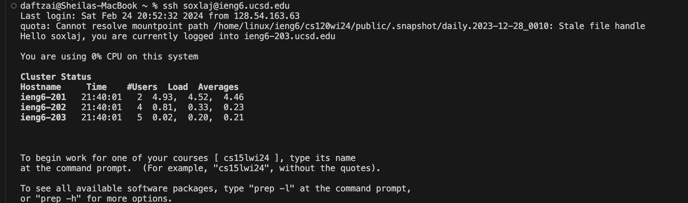
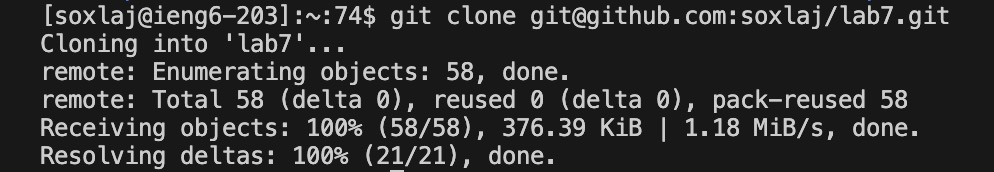
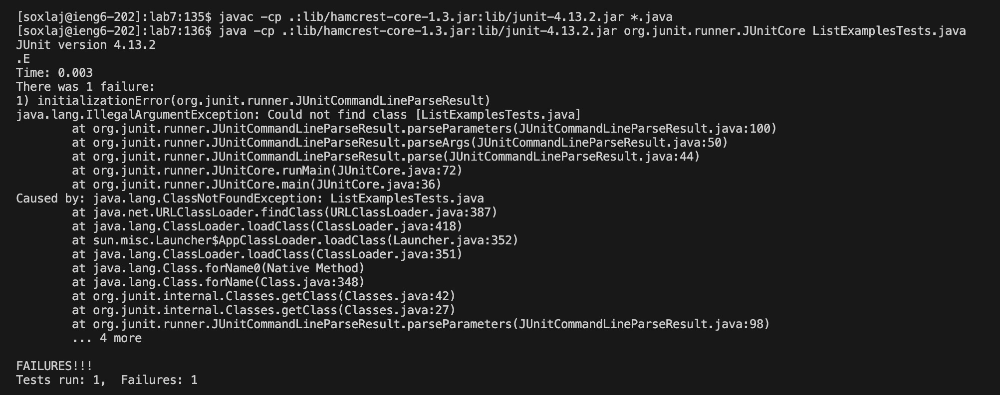
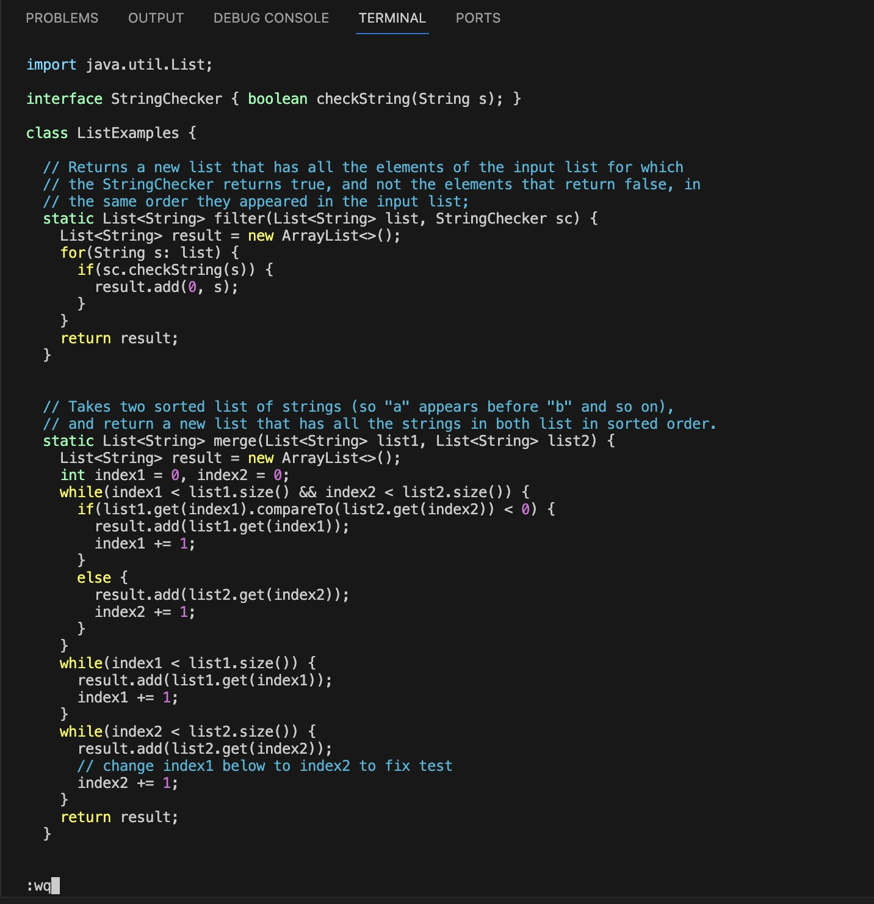
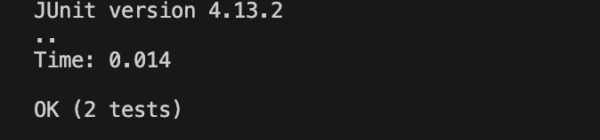
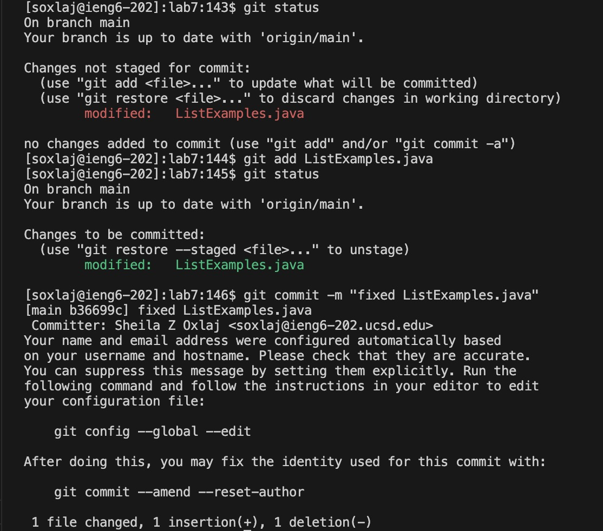
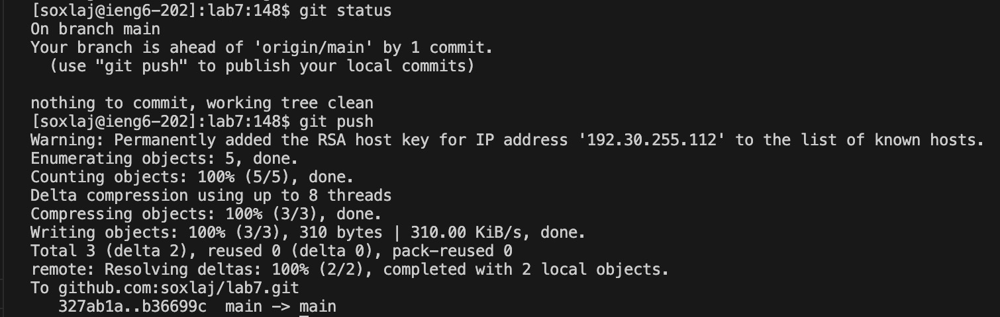
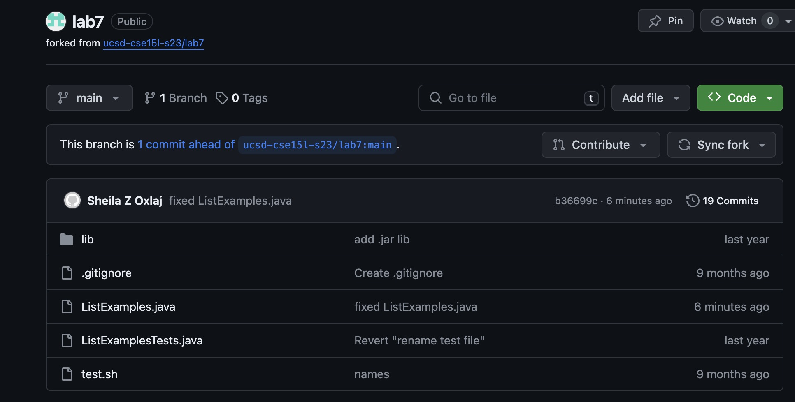

## Lab Report 4

### Steps 4 through 9 of lab7 reproduced
Summarize commands and explain what effect keypresses had

**Step 4**

Here I logged into ieng6 using `ssh soxlaj@ieng-202.ucsd.edu` command (not apparent in the screenshot but was later used because of issues with default `ieng6-203`) and this command essentially allows me to log in remotely to a server.  

**Step 5**

In this step, I cloned the `ssh` link of the fork of the repository of lab7 using `git clone <link>`. while in the ieng6 server and so this creates a clone on the remote server of the fork of the lab7 repository. Here, if you use `ls` we will see `lab7` as a file in the working directory, and for the next step we `cd` into `lab7` to work on this clone.

**Step 6**

In this step, I had already run these tests before and so I used the arrow keys (up) to access the same commands. The keys pressed were:
`<up><up><up><up><enter>` and `<up><up><up><up><enter>`
We reaccessed `javac -cp .:lib/hamcrest-core-1.3.jar:lib/junit-4.13.2.jar *.java` and `java -cp .:lib/hamcrest-core-1.3.jar:lib/junit-4.13.2.jar org.junit.runner.JUnitCore ListExamples.java` using the arrow keys in the sequence above to access them from the history. This access compiles and runs the JUnit tests and displays the tests failing from an error in the code. 

**Step 7**

In this step, as evident in the screenshot above, we enter `vim` mode using the command `vim ListExamples.java` to enter into vim and fix the error in the code found within the java file `ListExamples`. The `vim` command allows us to access and edit files from the terminal and in this instance allows us to access and edit the file `ListExamples.java` that is cloned in the remote server and to fix the error. 
Entering `vim` displays the output above, and in this we are in `normal mode` in which we use the arrow keys to navigate through the lines of code however we cannot make changes. To make a change, we need to enter `insert mode` where we can edit the characters in the file using keys and the set of keys we use to fix the error in the code are the following:
`<down>(43 times)<e><right><backspace><2>`
Note that `<e>` key goes to the end of a word and would go to the end of `index1` which is where we want to make a change, at `1` of the variable and replace it with `2`.

This changes the character that caused the tests to fail, and to exit `insert mode` we use the key:
`<esc>`

Leaving `insert mode` and entering `normal mode` we can now save and quit vim using the keys:
`<shift>+<;><w><q>`
In which the key `w` saves the changes made in `vim` and `q` exits out of `normal mode` and `vim` thus saving the change to the `ListExamples.java` file.

**Step 8**

Repeating from step 6, we rerun these tests using the up arrow keys to access the compile and run commands for the JUnit tests and end up with the output above from entering these commands:
`javac -cp .:lib/hamcrest-core-1.3.jar:lib/junit-4.13.2.jar *.java` and `java -cp .:lib/hamcrest-core-1.3.jar:lib/junit-4.13.2.jar org.junit.runner.JUnitCore ListExamples.java`
The output shows us that we successfully changed the error in the code in the file `ListExamples.java` as the tests successfully passed.

**Step 9**

In this step, we aim to commit and push the change to my GitHub account and the first two screenshots demonstrate the commands and output used to do so. 
First, I used `git status` to check that the file `ListExamples.java` was changed and the red `modified` in the screenshot confirms there have been changes in the clone in the remote server. Then confirming this, I use the command `git add ListExamples.java` to add the change to the list of commits and so it is ready to be pushed to GitHub as a change to be committed to the repository. 

Second, I once again use `git status` to confirm this change is ready to be committed and see the green `modified` along with the words `Changes to be committed` in the second screenshot which confirms that we can now commit these changes. To do so and to push this commit, I used the command `git commit -m "fixed ListExamples.java"` and this commits the change done within the file `ListExamples.java` to the clone. This inherently is a local commit and will not be reflected on my GitHub account.

To reflect it in my GitHub account we need to push it using the command `git push` which pushes all local commits to my GitHub account and so since I only did one commit, it pushed this one commit to my GitHub account in the forked repository with the message that `ListExamples.java` was fixed in the commit. 

In this last screenshot, we can see the push of the local commit of the change done in the terminal in a remote server with a cloned fork pushed to my GitHub account, and the commit is now reflected in the forked repository in my GitHub account along with its message `fixed ListExamples.java` which can be seen in the screenshot and shows that the push of the local commit was successful.
